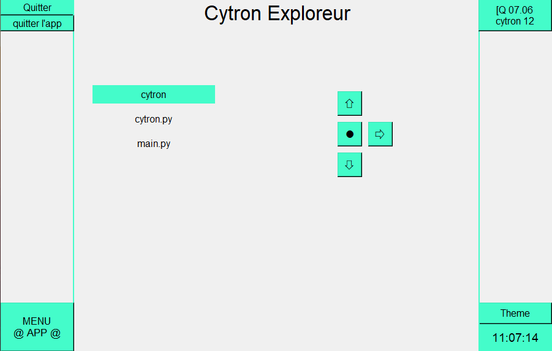
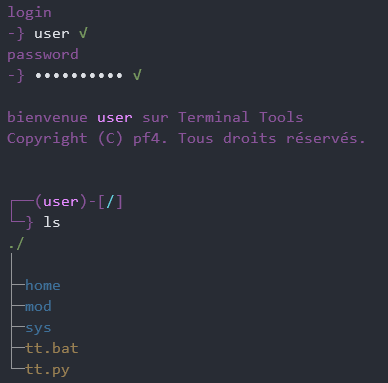

# <b>CYTRON</b>
## <b> Démarrage rapide </b>
### <b> Description </b>
Cytron est un module permettant d’interagir avec les dossier et fichier du système d’exploitation.
### <b> Installation </b>
Téléchargez le repository, et déplacez cytron.py dans le dossier de votre programme.

### <b> Importation </b>
```py
import cytron as cy 
```
## <b> Interaction </b>

<i> Ci dessous le notion de ‘chemin’ se réfère au chemin relatif ayant comme racine le dossier du programme. </i>

### <b>ls:</b>

<i>ls()</i> liste le contenu d'un dossier

<u>Syntaxe:</u>

```py
ls(chemin)
```
<u>Exemple:</u>

```py
print(cy.ls("/"))
```

### <b>version</b>

<i>version()</i> retourne la version de cytron.

<u>Syntaxe:</u>

```py
version()
```
<u>Exemple:</u>

```py
print(cy.version())
```

### <b>path</b>

<i>path</i> retourne le chemin que cytron utilise comme root.

<u>Syntaxe:</u>

```py
path()
```
<u>Exemple:</u>

```py
print(cy.path())
```

### <b>mkdir</b>

<i>mkdir</i> crée des dossiers.

<u>Syntaxe:</u>

```py
mkdir(chemin, nom)
```
<u>Exemple:</u>

```py
cy.mkdir("/", "coucou")
```

### <b>mkfil</b>

<i>mkfil</i> crée des fichiers.

<u>Syntaxe:</u>

```py
mkfil(chemin, nom, ContenuDuFichier)
```
<u>Exemple:</u>

```py
cy.mkfil("/", "livre.txt","Il était un fois une clé usb...")
```

### <b>rfil</b>

<i>rfil_rela</i> retourne le contenu de fichiers.

<u>Syntaxe:</u>

```py
rfil_rela(chemin, nom):
```
<u>Exemple:</u>

```py
print(cy.rfil_rela("/", "livre.txt"))
```

### <b>wget</b>

<i>wget</i> va comme <i>mkfil</i> crée des fichier mais cette fois avec du contenu recupéré de page web.

<u>Syntaxe:</u>

```py
wget(chemin, nom, url):
```
<u>Exemple:</u>

```py
cy.mkfil("/", "telechargement.ica", "https://raw.githubusercontent.com/passemblage/I-python-Public/main/appli%20ica/telechargement.ica")
```

## <b> Terminal intégré </b>

Cytron possède aussi un terminal intégré accessible avec <i>console()</i>.
se petit programme de 4 ligne l'utilise pour créé un petit terminal simplement

```py
import cytron as cy
cy.console()
while True:
    pass
```

la fontion <i>run</i> permet aussi d'executé une commande:


<u>Syntaxe:</u>

```py
cy.run(commande)
```
<u>Exemple:</u>

```py
print(cy.run("aide"))
```

```py
while True:
    commande = input("-> ")
    print(cy.run(commande))
```

Et voici les commande disponbles:

```
version > affiche la version
path    > affiche le chemain
mkdir   > crée un dossier
ls      > affiche le contenue d'un dossier
wget    > crée un fichier depuis le web
mkfil   > créé un fichier
rfil    > affiche le contenue d'un fichier
aide    > affiche l'aide
```

## <b> Programme utilisant cytron </b>

Quelque programme déjà utilise cytron comme I-python



ou terminal tools



<b>Bonne chance et amusé vous bien!</b>

Mon serveur discord: https://discord.gg/PFbymQ3d97

<i>-pf4 </i>